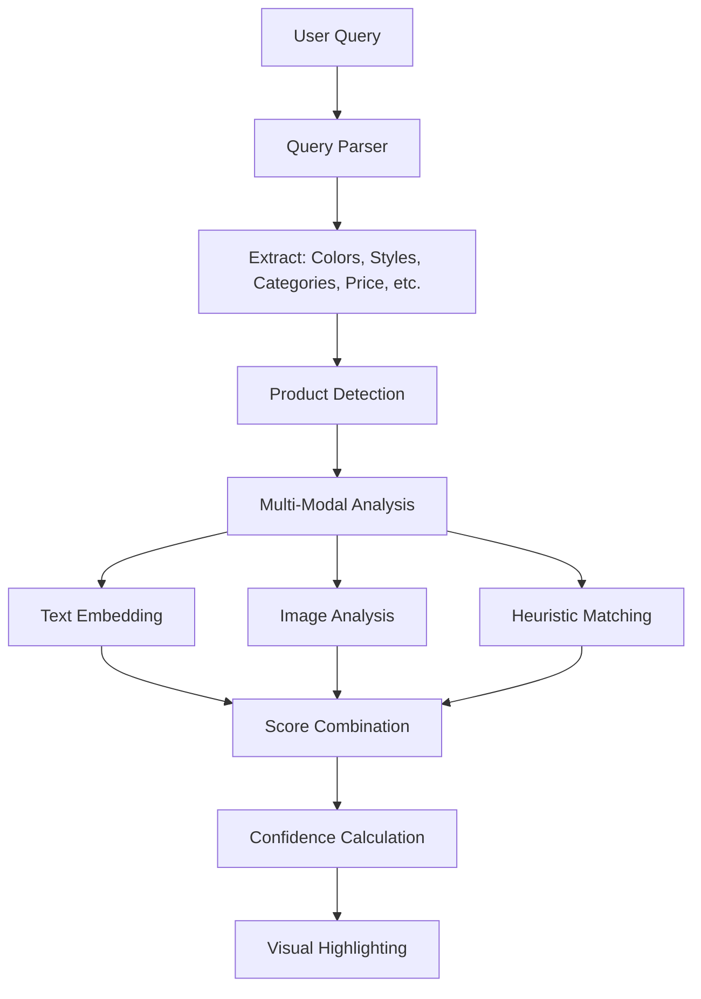

# 🛍️ AI Fashion Shopping Chrome Extension

A powerful, FREE Chrome extension that uses advanced AI to help users find fashion items on any e-commerce website. The extension analyzes webpage content in real-time and highlights products that match user search queries using sophisticated computer vision and natural language processing.

## ✨ Key Features

### 🧠 Advanced AI Analysis
- **Multi-Modal Understanding**: Combines image analysis (CLIP) with text processing
- **Fashion-Specific Intelligence**: Understands fashion terminology, colors, materials, and styles
- **Query Parsing**: Extracts colors, styles, brands, price ranges, and categories from natural language
- **Semantic Matching**: Goes beyond keyword matching to understand context and intent

### 🔍 Universal Product Detection
- **Dynamic Website Compatibility**: Works on ANY e-commerce site without hardcoded selectors
- **Intelligent Heuristics**: Combines CSS selectors, layout analysis, and content patterns
- **Real-Time Adaptation**: Handles dynamic content loading and modern SPAs
- **Performance Optimized**: Processes only visible content with smart caching

### 🎯 Smart Matching System
- **Confidence Scoring**: Multi-factor analysis with transparent confidence levels
- **Visual Highlighting**: Color-coded overlays based on match quality
- **Detailed Insights**: Click highlights for comprehensive analysis breakdown
- **Real-Time Results**: Sub-second processing with progressive enhancement

### 🚀 Performance Optimizations
- **Web Workers**: Heavy AI processing off the main thread
- **Intelligent Caching**: Avoids reprocessing identical content
- **Batch Processing**: Handles thousands of products efficiently
- **Memory Management**: Monitors and optimizes resource usage

## 🏗️ Architecture Overview

### Core Components

```
┌─────────────────┐    ┌─────────────────┐    ┌─────────────────┐
│   Content.js    │    │ ProductFinder.js │    │  AI-Worker.js   │
│                 │    │                 │    │                 │
│ • UI Management │    │ • Product       │    │ • FashionAI     │
│ • User Input    │    │   Detection     │    │ • Model Loading │
│ • Integration   │    │ • Analysis      │    │ • Query Parsing │
│ • Settings      │    │   Coordination  │    │ • ML Inference  │
└─────────────────┘    └─────────────────┘    └─────────────────┘
         │                       │                       │
         └────────── Communication via Chrome APIs ──────┘
```

### AI Pipeline



## 🔧 Installation & Setup

### Prerequisites
- Chrome Browser (Version 88+)
- 2GB+ RAM recommended
- Modern CPU for optimal performance

### Installation Steps

1. **Clone or Download**
   ```bash
   git clone <repository-url>
   cd chrome-extension
   ```

2. **Load Extension**
   - Open Chrome and navigate to `chrome://extensions/`
   - Enable "Developer mode" (top right toggle)
   - Click "Load unpacked" and select the extension folder
   - The extension icon should appear in the toolbar

3. **First Run**
   - Click the extension icon or press `Ctrl+Shift+F`
   - Allow 10-30 seconds for initial model loading
   - The UI will appear when ready

## 🎮 Usage Guide

### Basic Search
1. **Activate Extension**: Click icon or press `Ctrl+Shift+F`
2. **Enter Query**: Type natural language like "black leather jacket under $200"
3. **View Results**: Matching products are highlighted with color-coded overlays
4. **Get Details**: Click any highlight for detailed analysis

### Advanced Query Examples

```
✅ Good Queries:
• "vintage oversized black denim jacket"
• "minimalist white sneakers under $100"
• "formal navy blazer size L"
• "red evening dress with lace details"
• "casual brown leather boots waterproof"

❌ Avoid:
• Single words: "shoes"
• Too generic: "clothes"
• Nonsensical: "blue purple green"
```

### Query Components

| Component | Examples | Usage |
|-----------|----------|-------|
| **Colors** | black, white, navy, burgundy | Exact and semantic matching |
| **Materials** | leather, denim, cotton, wool | Texture and fabric analysis |
| **Styles** | vintage, modern, casual, formal | Style classification |
| **Categories** | jacket, shoes, dress, pants | Product type identification |
| **Brands** | Nike, Zara, Levi's, Adidas | Brand-specific filtering |
| **Price** | under $50, $100-200, cheap | Price range filtering |
| **Size** | S, M, L, XL, size 8 | Size-specific matching |

### Keyboard Shortcuts
- `Ctrl+Shift+F` (or `Cmd+Shift+F` on Mac): Toggle extension
- `Enter`: Start search
- `Escape`: Close extension
- `Double-click status`: Toggle settings/stats

## 🎨 Visual Indicators

### Highlight Colors
- 🟢 **Green (80%+ match)**: Excellent match - highly recommended
- 🟡 **Gold (60-79% match)**: Good match - worth considering  
- 🟠 **Orange (40-59% match)**: Fair match - partial relevance
- 🟡 **Yellow (25-39% match)**: Low match - weak relevance

### Confidence Levels
- **High**: Multiple signals confirm match
- **Medium**: Good evidence but some uncertainty
- **Low**: Limited matching signals
- **Very Low**: Minimal relevance detected

## ⚙️ Configuration Options

### Performance Settings
Access via double-clicking the status bar or through extension settings:

- **Performance Mode**: Fast vs. Balanced vs. Accurate
- **Confidence Threshold**: Minimum match percentage to display
- **Batch Size**: Products processed simultaneously
- **Cache Settings**: Memory usage optimization

### Advanced Options
- **Ollama Integration**: Use local Llava model for enhanced analysis
- **Debug Mode**: Detailed logging and performance metrics
- **Custom Models**: Configure alternative AI models

## 🔬 Technical Deep Dive

### AI Models Used

#### 1. Text Analysis
- **Primary**: `Xenova/all-MiniLM-L6-v2`
  - Semantic similarity for fashion text
  - 384-dimensional embeddings
  - ~22MB model size

#### 2. Vision Analysis  
- **Primary**: `Xenova/clip-vit-base-patch32`
  - Image-text matching capabilities
  - Joint embedding space
  - ~151MB model size

#### 3. Classification
- **Primary**: `Xenova/distilbert-base-uncased-mnli`
  - Zero-shot category classification
  - Fashion taxonomy understanding
  - ~67MB model size

### Product Detection Algorithm

```javascript
// Multi-strategy detection combining:
1. CSS Selector Matching
   - Product-specific classes (.product, .item, etc.)
   - E-commerce platform selectors
   - Data attributes ([data-product-id])

2. Heuristic Analysis
   - Size constraints (100x100 to 2000x2000 pixels)
   - Required elements (images, text)
   - Content patterns (prices, "buy" buttons)

3. Layout Recognition
   - Grid containers with similar children
   - Repeated patterns suggesting product listings
   - Image-to-text ratios indicating products
```

### Matching Algorithm

```javascript
// Comprehensive scoring system:
finalScore = (
    textScore * 0.35 +      // Semantic text similarity
    imageScore * 0.25 +     // Visual similarity (CLIP)
    heuristicScore * 0.20 + // Attribute matching
    categoryScore * 0.10 +  // Category classification
    styleScore * 0.10       // Style alignment
);

// Dynamic weighting based on query type:
- Visual queries: Increase image weight
- Specific queries: Increase heuristic weight
- General queries: Balanced weighting
```

### Performance Optimizations

#### 1. Intelligent Caching
```javascript
// Multi-level caching strategy:
- Query Cache: Parsed queries for reuse
- Product Cache: Analysis results by content hash
- Image Cache: Processed image embeddings
- Model Cache: Loaded models persist across sessions
```

#### 2. Progressive Loading
```javascript
// Optimized loading sequence:
1. Process visible products first
2. Use Intersection Observer for off-screen items
3. Batch processing with configurable concurrency
4. Memory monitoring with automatic cleanup
```

#### 3. Web Worker Architecture
```javascript
// Isolated processing pipeline:
Main Thread: UI updates, DOM manipulation
Worker Thread: AI inference, heavy computations
Communication: Structured message passing
Error Handling: Graceful fallbacks and recovery
```

## 🏆 Performance Benchmarks

### Typical Performance (on modern hardware)

| Metric | Value | Notes |
|--------|--------|--------|
| **Initial Load** | 5-15 seconds | One-time model loading |
| **Query Processing** | 50-200ms | Parsing and analysis |
| **Product Analysis** | 100-500ms per item | Depends on content size |
| **Page with 50 products** | 2-8 seconds | Batch processing |
| **Memory Usage** | 100-300MB | Including models |
| **Cache Hit Rate** | 70-90% | For repeated content |

### Optimization Tips

1. **Reduce Confidence Threshold**: Show more results, process faster
2. **Enable Performance Mode**: Sacrifice accuracy for speed
3. **Use Smaller Batch Sizes**: Better for low-memory devices
4. **Clear Cache Periodically**: Prevent memory bloat

## 🛠️ Development Guide

### Project Structure

```
chrome-extension/
├── manifest.json           # Extension configuration
├── background.js          # Service worker (minimal)
├── content.js            # Main UI and coordination
├── ProductFinder.js      # Product detection and analysis
├── ai-worker.js         # AI processing pipeline
├── styles.css           # Enhanced UI styling
├── settings.html        # Options page
├── settings.js          # Settings management
├── images/             # Extension icons
└── README.md           # This documentation
```

### Key Classes

#### 1. FashionAI (ai-worker.js)
```javascript
class FashionAI {
    // Core AI functionality
    async initialize(progressCallback)
    parseQuery(query) 
    async analyzeProduct(productData, parsedQuery)
    // + 20 helper methods for fashion analysis
}
```

#### 2. ProductFinder (ProductFinder.js)
```javascript
class ProductFinder {
    // Orchestrates the entire process
    async findMatchingProducts(query)
    _detectProductCandidates()
    _updateProductHighlight(element, result)
    // + Performance monitoring and caching
}
```

#### 3. ProductDetector (ProductFinder.js)
```javascript
class ProductDetector {
    // Dynamic product detection
    async detectProducts()
    extractProductData(element)
    _detectBySelectors()
    _detectByHeuristics()
    _detectByLayout()
}
```

### Adding New Features

#### 1. New Fashion Categories
```javascript
// In ai-worker.js, update _initializeFashionTerms()
_initializeFashionTerms() {
    return {
        categories: {
            'newCategory': ['term1', 'term2', 'term3'],
            // ... existing categories
        }
    };
}
```

#### 2. Custom Highlighting Styles
```javascript
// In ProductFinder.js, modify _updateProductHighlight()
_updateProductHighlight(element, result) {
    // Add custom logic for different highlight styles
    const customStyle = this._getCustomStyle(result);
    overlay.style.cssText += customStyle;
}
```

#### 3. New AI Models
```javascript
// In ai-worker.js, add to FashionAI.initialize()
this.models.customModel = await pipeline(
    'your-task-type',
    'your-model-name',
    { quantized: true }
);
```

### Testing Strategy

#### 1. Unit Testing
```javascript
// Test individual components
describe('Query Parser', () => {
    test('extracts colors correctly', () => {
        const parsed = fashionAI.parseQuery('black leather jacket');
        expect(parsed.colors).toContain('black');
        expect(parsed.materials).toContain('leather');
    });
});
```

#### 2. Integration Testing
```javascript
// Test full workflow
describe('End-to-End Search', () => {
    test('finds products on test page', async () => {
        await productFinder.findMatchingProducts('red shoes');
        const highlights = document.querySelectorAll('.fashion-ai-highlight');
        expect(highlights.length).toBeGreaterThan(0);
    });
});
```

#### 3. Performance Testing
```javascript
// Monitor performance metrics
const startTime = performance.now();
await productFinder.findMatchingProducts(query);
const duration = performance.now() - startTime;
expect(duration).toBeLessThan(5000); // 5 second max
```

### Debugging Tips

#### 1. Enable Debug Logging
```javascript
// In content.js, set debug flag
const DEBUG_MODE = true;
if (DEBUG_MODE) console.log('Debug info:', data);
```

#### 2. Monitor Performance
```javascript
// Access performance stats
fashionAIInstance.getPerformanceStats();
// Returns: { timings, counters, memory }
```

#### 3. Inspect AI Analysis
```javascript
// Double-click status bar to see:
// - Model loading progress
// - Cache statistics  
// - Memory usage
// - Processing times
```

## 🚨 Troubleshooting

### Common Issues

#### 1. "AI models not loading"
**Symptoms**: Extension stuck on "Loading models..."
**Solutions**:
- Check internet connection
- Disable other extensions temporarily
- Clear browser cache
- Restart Chrome

#### 2. "No products detected"
**Symptoms**: "No products found on this page"
**Solutions**:
- Try different search terms
- Check if page has finished loading
- Look for products in different page sections
- Some sites may use non-standard layouts

#### 3. "Poor matching results"
**Symptoms**: Irrelevant products highlighted
**Solutions**:
- Use more specific search terms
- Include colors, materials, or styles
- Try different query phrasings
- Adjust confidence threshold in settings

#### 4. "Performance issues"
**Symptoms**: Slow response, browser lag
**Solutions**:
- Enable Performance Mode in settings
- Close other tabs/applications
- Clear extension cache
- Reduce batch size in settings

### Error Messages

| Error | Meaning | Solution |
|-------|---------|----------|
| "Worker initialization timeout" | AI worker failed to load | Refresh page, check network |
| "Failed to initialize AI models" | Model loading failed | Clear cache, restart browser |
| "ProductFinder class not available" | Script loading error | Disable conflicting extensions |
| "Analysis failed" | AI processing error | Try different query, refresh page |

## 📊 Analytics & Insights

### Usage Metrics (Auto-collected)
- Search frequency and patterns
- Popular query types
- Performance characteristics
- Error rates and types
- Feature usage statistics

### Privacy Note
All processing happens locally in your browser. No search data is transmitted to external servers (except when using optional Ollama integration).

## 🔮 Future Enhancements

### Planned Features
- [ ] **Visual Search**: Upload/capture images to find similar items
- [ ] **Price Tracking**: Monitor price changes for highlighted items
- [ ] **Wish Lists**: Save interesting products for later
- [ ] **Size Recommendations**: AI-powered size matching
- [ ] **Style Profiles**: Learn user preferences over time
- [ ] **Social Features**: Share finds with friends
- [ ] **Mobile Support**: React Native app with similar functionality

### Technical Improvements
- [ ] **Model Quantization**: Smaller, faster models
- [ ] **Edge Computing**: Offline-first architecture
- [ ] **Multi-language**: Support for non-English sites
- [ ] **Accessibility**: Screen reader compatibility
- [ ] **Performance**: Sub-second analysis for all queries

## 🤝 Contributing

We welcome contributions! Here's how to get started:

1. **Fork the Repository**
2. **Create Feature Branch**: `git checkout -b feature/amazing-feature`
3. **Make Changes**: Follow the existing code style
4. **Add Tests**: Ensure new features are tested
5. **Update Documentation**: Keep README.md current
6. **Submit Pull Request**: Detailed description of changes

### Development Setup
```bash
# Clone repository
git clone <your-fork-url>
cd chrome-extension

# Load in Chrome for testing
# chrome://extensions/ -> Load unpacked

# Make changes and test
# Refresh extension to see updates
```

## 📜 License

This project is open source and available under the [MIT License](LICENSE).

## 🙏 Acknowledgments

- **Transformers.js**: Enabling client-side AI inference
- **Hugging Face**: Providing pre-trained models
- **Chrome Extensions API**: Powerful browser integration
- **Open Source Community**: Inspiration and contributions

## 📞 Support

- **Issues**: [GitHub Issues](link-to-issues)
- **Discussions**: [GitHub Discussions](link-to-discussions)
- **Email**: [support@example.com](mailto:support@example.com)
- **Discord**: [Join our community](link-to-discord)

---

**Made with ❤️ for fashion enthusiasts and AI lovers**

*Happy shopping! 🛍️* 